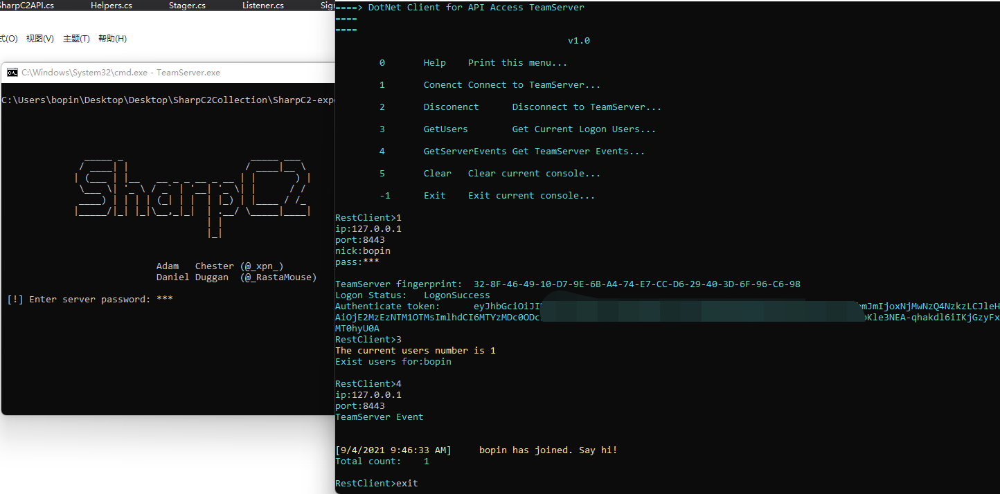

# Rest Client

> Depends on SharpC2 that the prior version if you have kept track of it.

> RestClient is a Control Side based-commandline or console to access SharpC2's TeamServer 

**Important**   

> Reference from https://restsharp.dev/getting-started/

